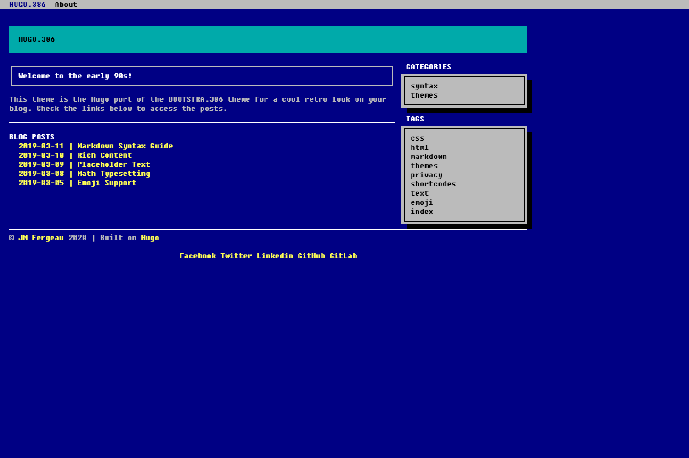

# [🕹️ Tech PlayGround](https://tech-playground.netlify.app)

[🕹️ Tech PlayGround](https://tech-playground.netlify.app) is a community blog for people to share tech projects, tips, best practices, verdicts or just fun facts of live 🦩. The theme is designed by JM Fergeau, who got the idea from HUGO.386 [BOOTSTRA.386](//github.com/kristopolous/BOOTSTRA.386) theme. It has a cool MS-DOS feeling and is ready to be used for blogs. Despite its antique look, the theme is responsive and can be viewed on mobile devices.



## How to get involved?

- clone this git repo
```
git clone https://github.com/applegreengrape/tech-playground.git
```

- set up the local development hugo env
```
 $ cd site && hugo server --themesDir ../..
```
The hugo server will be ready at [`localhost:1313`](http://localhost:1313).

- add your post 👇
`./site/content/post/`
You can check `markdown-syntax.md` for the markdown tips. 

- commit your post and raise a merge request
Once your commit merged into the master, it will automatically kick off the netlify deployment. Normally within 1 minute, the new site with your post will be ready.  

For more information read the official [setup guide](//gohugo.io/overview/installing/) of Hugo.

## License

This theme is released under the Apache License 2.0 For more information read the [License](//github.com/digitalcraftsman/hugo-freelancer-theme/blob/master/LICENSE).


## Annotations

Thanks to [JM Fergeau](//jmf-portfolio.netlify.com) for creating this hugo theme. 
Thanks to [Steve Francia](//github.com/spf13) for creating Hugo and the awesome community around the project. Many thanks to [Kristopolous](//github.com/kristopolous) as well for the BOOTSRTA.386 theme, even if it's a bit outdated today. (and i'm not speaking of the retro look)